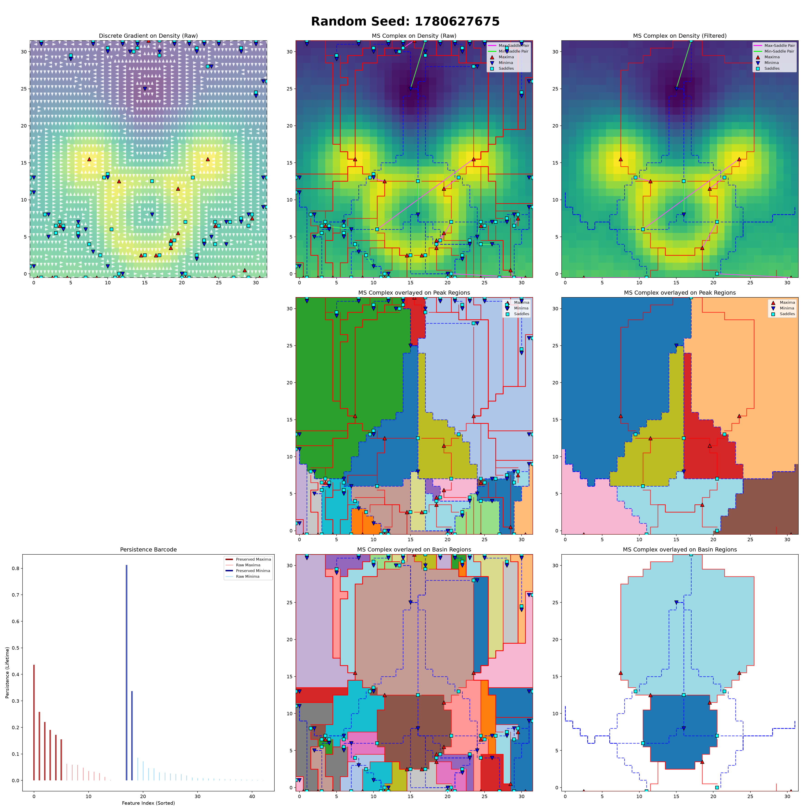
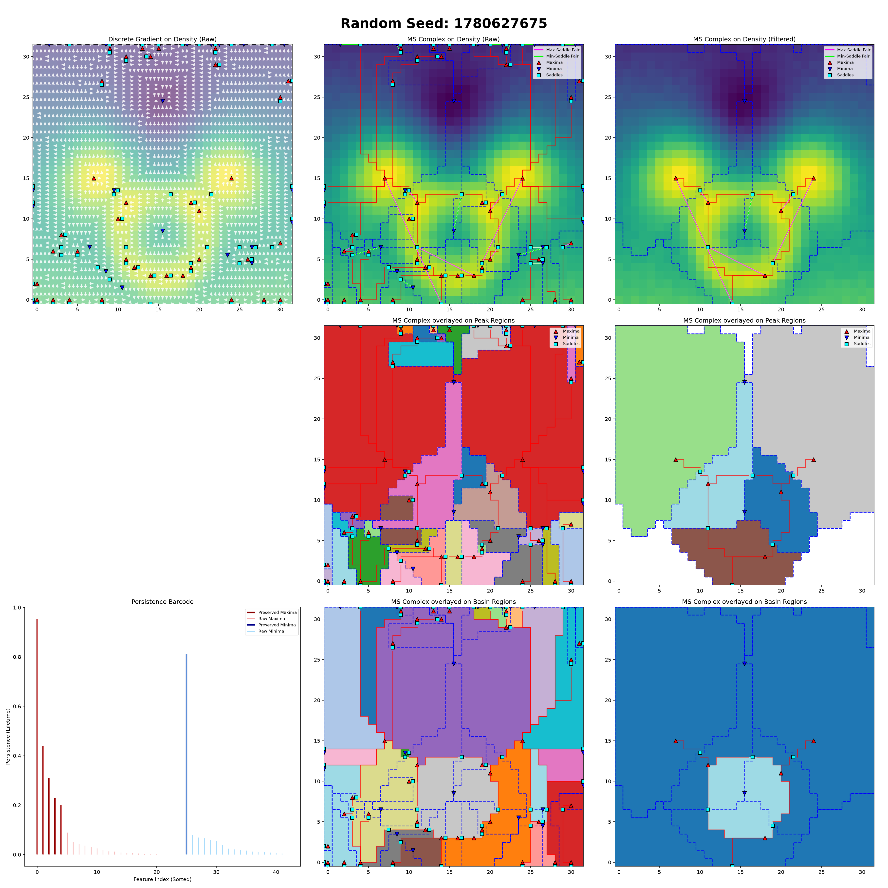

# Discrete Morse-Smale Complex (DMSC)

Hardware-accelerated PyTorch extension for extracting the Discrete Morse-Smale Complex from 2D scalar fields defined over regular images using discrete persistent homology.

This library computes topological critical points (maxima, minima, saddles), persistence pairs, ascending/descending arcs (ridges and valleys), and 2-manifold (basins and peaks). It is written in C++ with native backend support for **CPU (TBB)**, **NVIDIA GPUs (CUDA)**, and **Apple Silicon (Metal/MPS)**.

## Features
* **Topological Simplification**: Filters out topological noise using Persistence Thresholding.
* **Full Geometry**: Optionally extract the full geometry of the segmentation including exact ridge/valley lines and pixel-perfect basin segmentations.
* **Morse-Smale complex**: Exact morse smale complex connectivity based on discrete Morse theory.

## Installation with `uv`

DMSC builds native C++ and, when available, CUDA or Metal code. Install a C++17
compiler first; CUDA builds also require a working NVIDIA driver and a CUDA
toolkit containing `nvcc`.

Clone the repository:

```bash
git clone https://github.com/thierry-sousbie/dmsc.git
cd dmsc
```

### CPU or Apple Silicon (Metal/MPS)

On macOS:

```bash
uv sync
uv run pytest
```

`uv sync` creates the project-local `.venv` automatically if it does not
already exist.

PyTorch's macOS wheel includes MPS support. DMSC selects CUDA, MPS, or CPU from
the input tensor's device; no separate Metal package is required.

For an explicitly CPU-only Linux environment:

```bash
uv sync --torch-backend=cpu
uv run pytest
```

### NVIDIA CUDA

Choose a CUDA backend supported by the installed NVIDIA driver and by the
available PyTorch wheels. Check the current PyTorch installation selector rather
than assuming that the locally installed CUDA toolkit determines the wheel.
Replace `BACKEND` below with the selected `uv` PyTorch backend. For example,
`cu128` for CUDA 12.8.

```bash
uv venv
uv pip install torch torchvision --torch-backend=BACKEND
uv pip install -e . --no-build-isolation
```

Installing PyTorch first and disabling build isolation ensures that DMSC is
compiled against that exact PyTorch installation instead of a second build-time
copy.

After selecting PyTorch manually, prevent `uv` from replacing it with the
version selected by `uv.lock`:

```bash
uv run --no-sync pytest
uv run --no-sync benchmark.py --workload segmentation --no-cpu
uv run --no-sync python your_script.py
```

Running `.venv/bin/python` also uses the environment unchanged, but
`uv run --no-sync` is the portable `uv` form. Plain `uv run` is appropriate
when the environment is managed entirely with `uv sync`.

Verify the active backend before testing or benchmarking:

```bash
uv run --no-sync python -c \
  "import torch; print(torch.__version__); print(torch.version.cuda); print(torch.cuda.is_available())"
```

### Common installation problems

- **No compatible PyTorch CUDA build is found**: select a backend offered for
  the desired PyTorch release, install PyTorch with
  `--torch-backend=BACKEND`, then install DMSC with `--no-build-isolation`.
- **PyTorch was upgraded or its backend changed**: rerun
  `uv pip install -e . --no-build-isolation`. Native extensions must be rebuilt
  against the active PyTorch installation.
- **CUDA is unavailable**: check `nvidia-smi` and `nvcc --version`. A
  CUDA-enabled PyTorch wheel cannot replace a missing host driver or compiler.
- **`uv run` rebuilds or downloads PyTorch**: use `uv run --no-sync` when
  PyTorch was selected with `uv pip`; otherwise let `uv sync` manage the full
  environment.

## Visualizations

You can generate complete visual dashboards of the vector fields, critical points, and segmentations using the built-in plotting utilities.

```python
# Render a full 3x2 dashboard for a single complex
complex_data.plot(img, filename="dashboard.png")

# Or render a 3x3 dashboard comparing raw and filtered complexes side-by-side
complex_raw.plot(img, ms_flt=complex_flt, filename="comparison_dashboard.png")

# You can also plot individual components directly on a matplotlib axis:
import matplotlib.pyplot as plt
fig, ax = plt.subplots()
complex_data.plot_gradient(ax, img)
complex_data.plot_complex(ax, img, plot_boundaries=True, plot_edges=True)
complex_data.plot_barcode(ax, ms_other=complex_flt)
```

### Primal Orientation (`is_dual=False`)
*Maxima act as faces (pixel corners), Saddle Points as edges (segments between pixels), Minima act as vertices vertices (pixel center).*


### Dual Orientation (`is_dual=True`)
*Minima act as faces (pixel corners), Saddle Points as edges (segments between pixels), Maxima act as vertices vertices (pixel center).*



## Quick Start & Testing

To verify your installation and see the library in action, run the test script. It will extract the complex from a sample scalar field and generate the dashboard images shown above:

```bash
uv run python test_dmsc.py
```

For a manually configured CUDA environment, add `--no-sync` as described in
the installation section.

### Basic Usage

```python
import torch
from dmsc import compute_dmsc, generate_noisy_landscape

# Use CUDA when available, otherwise Apple MPS or CPU.
device = (
    "cuda" if torch.cuda.is_available()
    else "mps" if torch.backends.mps.is_available()
    else "cpu"
)
img = generate_noisy_landscape(H=256, W=256, with_loop=True).to(device)

# Extract the Morse-Smale Complex
# persistence_threshold: Filters topological noise below this value
complex_data = compute_dmsc(
    img, 
    persistence_threshold=0.1, 
    is_dual=False
)

# Convert raw cell IDs to actual [Y, X] grid coordinates
maxima_coords = complex_data.offset_max_pts_yx
print(f"Found {len(maxima_coords)} persistent maxima!")
```

`compute_dmsc` parameters:
```python
def compute_dmsc(
    img,
    persistence_threshold,
    return_gradient=True,
    is_dual=False,
    trace_valleys=True,
    trace_ridges=True,
    trace_peaks=True,
    trace_basins=True,
    verbose=False,
)
```

* **`img`**: A 2D `[H, W]` or 3D `[B, H, W]` scalar tensor.
* **`persistence_threshold`**: Topological noise threshold.
* **`return_gradient`**: If `True`, returns the raw combinatorial vector field mappings.
* **`is_dual`**: `False` (Primal: Maxima as Faces), `True` (Dual: Maxima as Vertices).
* **`trace_valleys` / `trace_ridges`**: Flags to toggle the precise extraction of the descending (valleys) and ascending (ridges) 1-manifolds lines.
* **`trace_peaks` / `trace_basins`**: Flags to toggle the exact pixel-level extraction of the ascending (peaks) and descending (basins) 2-manifolds segmentations.
* **`verbose`**: Prints execution timings to the console.

> [!NOTE]
> **Multithreading**: The number of threads used is automatically controlled by your PyTorch environment. You can adjust this dynamically using `torch.set_num_threads(N)`.


## Understanding the `MSComplex` Structure

Because this library operates on a mathematical cell complex (where edges and faces exist between pixels), raw topological entities are returned as flat 1D tensors of `cell_ids`.

### The Coordinate System

To map a raw `cell_id` back to a usable 2D image coordinate `[y, x]`, use the built-in decoding functions:

* `complex.to_coordinates_yx(cell_tensor, staggered=True)`: Returns float coordinates. Edges and faces are offset by `-0.5` to represent their true geometric position between pixels.
* For convenience, `offset_max_pts_yx`, `offset_min_pts_yx`, and `offset_sad_pts_yx` are provided as properties.

### Data Attributes

When you call `compute_dmsc()`, it returns an `MSComplex` dataclass containing:

#### 1. Critical Points
* **`max_pts` / `min_pts` / `sad_pts`**: 1D tensors containing the raw `cell_ids` of all surviving Maxima, Minima, and Saddles after persistence filtering.
* **`p_max` / `p_min`**: 1D tensors storing the persistence value (lifetime) of each respective maximum and minimum.

#### 2. Graph Connectivity
* **`e_max`**: A tensor of shape `(E, 2)`. Each row `[saddle_idx, max_idx]` represents an edge in the MS graph connecting a Saddle to a Maximum.
* **`e_min`**: A tensor of shape `(E, 2)`. Each row `[saddle_idx, min_idx]` represents an edge connecting a Saddle to a Minimum.

#### 3. Topological Segmentation (Regions)
* **`peaks`**: A dense 2D grid tensor. The integer at each pixel represents the index of the Maximum that this pixel flows ascendingly towards (the ascending basin).
* **`basins`**: A dense 2D grid tensor. Maps each pixel to the Minimum it flows descendingly towards (the descending basin).

#### 4. Manifold Geometry (Ridges & Valleys)
Because ridges and valleys have varying lengths, they are stored in a flattened CSR (Compressed Sparse Row) format.
* **`ridges`**: A flat 1D tensor of all `cell_ids` making up the ascending manifolds (lines connecting Saddles to Maxima).
* **`ridge_offsets`**: Use this to slice the `ridges` array for a specific saddle.
* **Helper Function**: `complex.get_ridge(saddle_idx, split_arcs=True)` returns the exact sequence of cells forming the lines from a saddle to its two connected maxima.
* *(The exact same structure exists for descending manifolds via `valleys` and `valley_offsets`)*.

## Primal vs. Dual Grid

The `is_dual` flag flips how the mathematical cell complex overlays your pixel grid.

* **Primal (`False`)**: Image pixels are treated as 0D vertices. Maxima will be placed between 4 pixels (as 2D faces). This is standard for elevation data.
* **Dual (`True`)**: Image pixels are treated as 2D faces. Maxima will sit exactly on the pixels, and Minima will be placed at the intersections between pixels. This is often preferred for density maps or probability heatmaps.

Note that the image boundaries are made of faces and segments, which creates an asymetry in the way maxima and minima have to be treated. Pick the one you prefer (or both) depending on your goal.

## TODOs

This project is in very early stage, but here are a few things I may add in the future:

- Implementation of loss functions for topological segmentation
- Support for 3D (maybe later ...)
